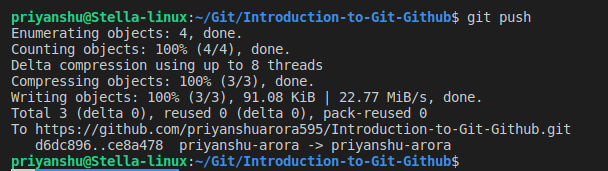
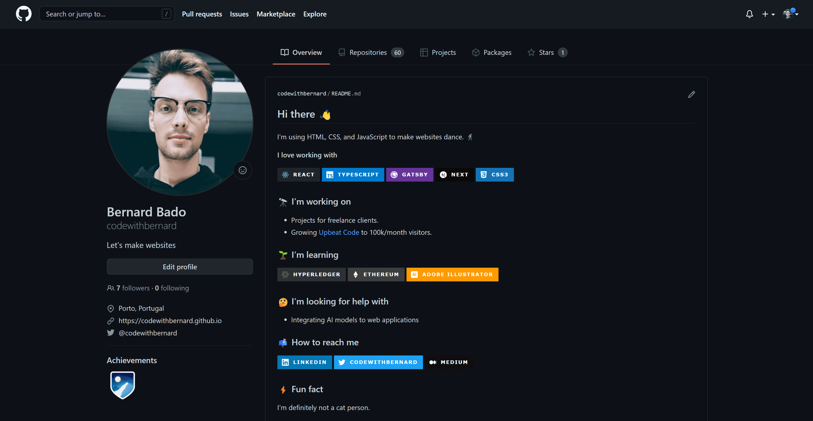
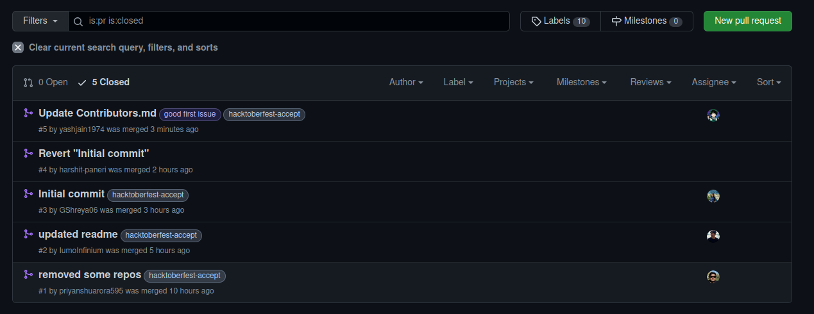

<br>
<br>


# Introduction
<br>

This is an introductory repository for all the beginners and newbies to know about Git and Github.
The aim of this repo is to make beginners aware about how to use git and github in an easy way.
<br>

---

## Git
 
Git is open-source version control software, used for managing and tracking file revisions. It can be used with any file type, but is most often used for tracking code files. Git is the most widely used version control system in software development, and GitHub leverages this technology for its service, hence its name.

<br>



<br>

---

## Github

<br>

GitHub allows software developers and engineers to create remote, public-facing repositories on the cloud for free. Once you’ve set up a repository on GitHub, you can copy it to your device, add and modify files locally, then “push” your changes back to the repository where your changes are displayed to the public.

<br>



<br>

---

<br>

## GitHub essentials are:
* Repositories
* Branches
* Commits
* Pull Requests
* Git (the version control software GitHub is built on)

------

<br>

## Repository

A GitHub repository can be used to store a development project.

It can contain folders and any type of files (HTML, CSS, JavaScript, Documents, Data, Images).

A GitHub repository should also include a licence file and a README file about the project.

A GitHub repository can also be used to store ideas, or any resources that you want to share.

<br>

----

<br> 

## Branch

A GitHub branch is used to work with different versions of a repository at the same time.

By default a repository has a master branch (a production branch).

Any other branch is a copy of the master branch (as it was at a point in time).

New Branches are for bug fixes and feature work separate from the master branch. When changes are ready, they can be merged into the master branch. If you make changes to the master branch while working on a new branch, these updates can be pulled in.

<br>


<br>

---

<br>

## Commits

<br>

At GitHub, changes are called commits.

Each commit (change) has a description explaining why a change was made.

Example - 

```bash
git commit -m <message>

git commit -m "First commit"
```
<br>

---

<br>

## Pull Requests

<br>

Pull Requests are the heart of GitHub collaboration.

With a pull request you are proposing that your changes should be merged (pulled in) with the master.

Pull requests show content differences, changes, additions, and subtractions in colors (green and red).

As soon as you have a commit, you can open a pull request and start a discussion, even before the code is finished.

<br>



<br>

---

<br>

## Resources

Here are some of the repositories from the members of this club, You can go through them and play with them and practice :

* [Mini Website - Harshit Paneri](https://github.com/harshit-paneri/mini-webiste)
* [Web Location - Harshit Paneri](https://github.com/harshit-paneri/Web-Location)
* [DSA for everyone - Priyanshu Arora](https://github.com/priyanshuarora595/dsa-for-everyone)
* [Basic Tip Calculator - Priyanshu Arora](https://github.com/priyanshuarora595/BasicTipCalculator)
* [Random Quote Generator - Priyanshu Arora](https://github.com/priyanshuarora595/Random-Quote-Generator)

<br>

---

<br>

## Conclusion

With this, we come to an end but its not over yet. Now you have the basic knowledge about Git and Github, so what are you waiting for ? Get started with repositories and start contributing and learning. Keep practicing and developing.

### Happy Hacking 👍 🥳
